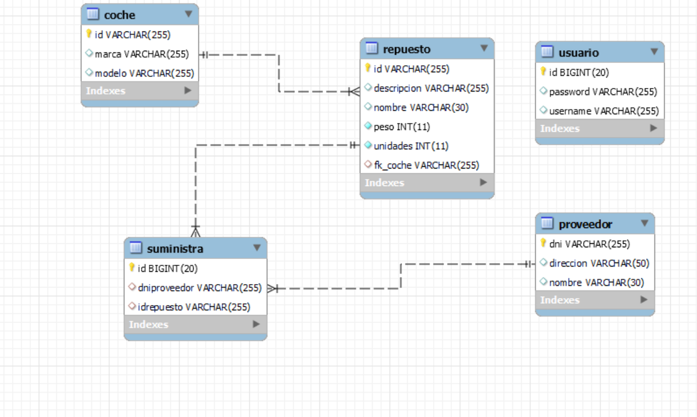

# Instalación y despliegue de las base de datos con docker

## Requisitos:
- Tener docker desktop instalado y abierto.
- Versión utilizada: 4.26.1 (131620).
- Link de descarga: [aqui](https://www.docker.com/products/docker-desktop/).
- Tutorial para la instalación:[aqui](https://docs.docker.com/desktop/install/windows-install/).
- Que el puerto 3306 esté disponible.
- Archivo .env con las variables necesarias.

## Pasos:
 1. Abrir un cmd y desplazarse a donde se tenga la carpeta de docker.
 2. Levantar el contenedor por primera vez:
```
docker compose up 
```    
3. Para pararlo debería ser suficiente con Ctrl + C la primera vez.
4. Para arrancar el contenendor cuando ya lo tienes creado el comando ese el siguiente:
```
docker start autorecambios-mysql
```  
5. Para parar el contenedor el comando es el siguiente:
```
docker stop autorecambios-mysql
```
6. Para destuir el contenedor:
```
docker compose down
```
7. Si se tiene la aplicación de docker desktop se puede arrancar y parar desde allí.

## Entidad relación:
